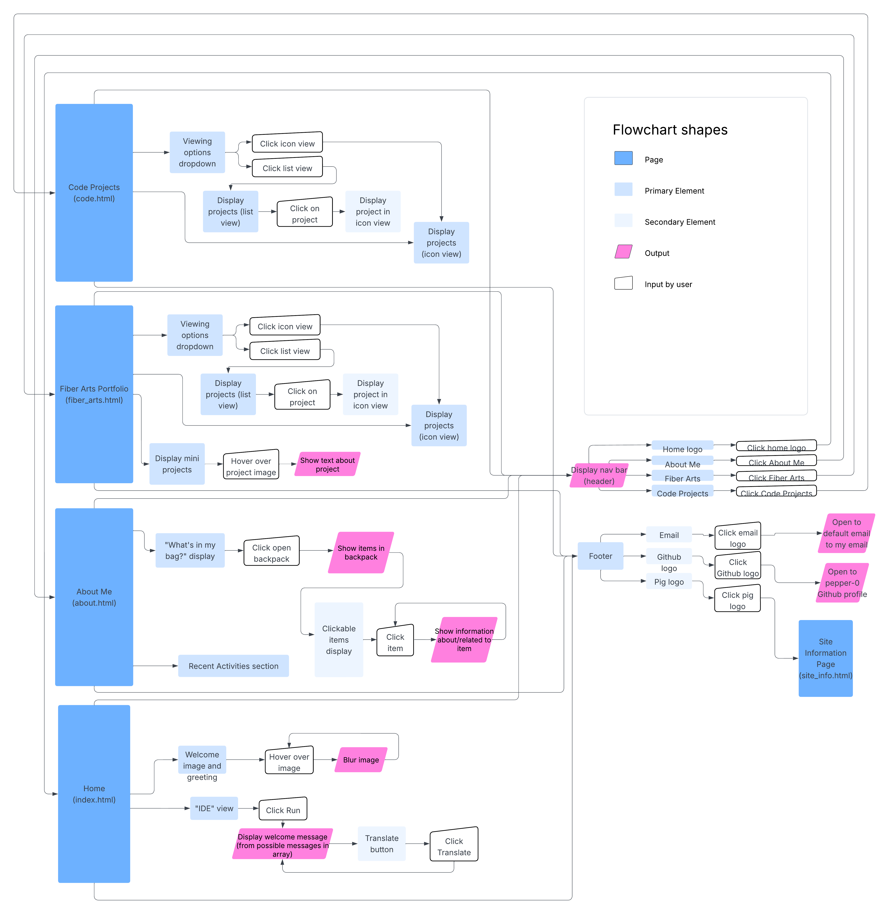

# meet jana: my personal website!
meet jana is my personal website that I made myself! it's a way for people to get to learn more about me :)

### To Access ⋆·˚✮ 🔗
visit the most recent deployment ([or linked here](https://pepper-0.github.io/meet-jana/)). no installation/dependencies needed. 

### Accessing Outputs ⋆·˚✮ ➡️
- program doesn't have traditional 'outputs', but rather outputs visual displays and elements for users to learn about me and my projects.
- specific interactive outputs:
  - IDE section reveals welcome message when "run" button is clicked, and includes navigation links for the user to click to different pages.
  - About Me includes a clickable "what's in my bag" section, where a user clicks on items inside the 'bag' to see different information to learn more about me.
  - List & Icon Views in both portfolios can be accessed through hovering the viewing options. this allows the user to view projects in a condensed or in depth manner.
  - hover effects are all throughout the program and add to the page's responsiveness by showing the user what can be clicked on.

### Function ⋆·˚✮ 🚧
"meet jana" is a personal website project made using HTML, CSS, and Javascript. It's a way for you to get to know me-- through a homepage, about me, fiber arts portfolio and code project portfolio. The project also has some cool features, like:
- An interactive "IDE" section in the Home page with a welcome message (+ a translate button) and links to all the other pages
- An interactive "What's in my bag?" section in the About Me page, with clickable items that reveal information about myself
- A dropdown in both the fiber arts portfolio and code projects portfolio that controls the way the projects are displayed (either list or icon view). List view offers a condensed version of items which can be expanded into icon view when clicked. Icon view shows a full version of all projects.
- Other interactive elements: hovering creates color or scale changes to many elements, adding responsiveness for the user

### Purpose ⋆·˚✮ 📍
- This project was initially created for the Girls Who Code Web Development track, Course 1 (Personal Website Project). 
- This project is also going to be submitted to the Athena Award program. 
- I especially wanted to expand this project not only to gain more experience with HTML/CSS/Javascript, but also because I have wanted to create a personal website for a long time. I hadn't had the skills or time to do so, so with the foundational knowledge given through GWC and incentive by Athena, it pushed me to actually create something I've wanted to make for a long time!

### Creation Process ⋆·˚✮ 📋
- I first started with a basic MVP which was submitted to Girls Who Code- this included all the pages I had, but was very static and had almost no responsiveness.
- After Girls Who Code, I revamped the entire UI by creating a personal palette (including fonts, logo, color palettes) and moved information to where I'd actually want it to be.
- The following are improvements I made in succession:
1. updated the nav bar and cleaned up animations for hovering
2. moved basic biography information to About Me, replacing index.html with a header image and interactive IDE-inspired intro
3. added footer to all pages
4. created the "What's in my bag?" section in the About Me, replacing static biography information with a clickable, responsive interface
5. Created icon and list views for portfolio pages
6. Updated site information page and README

### Key Learning Points ⋆·˚✮ 📌
- as mentioned prior, this was my first time using HTML/CSS/JS ever, so the project involved me learning a lot about the languages itself and their functionality.
- A lot of functionality I struggled with understanding, but mainly used W3Schools or Github Copilot to be able to see the scope of what the languages could offer.
- Almost all of my code is written by myself- the only instances of AI usage are complex debugs (especially with the list/icon view programming in JavaScript) and some complex code functionality (though a majority of them are later re-adapted by myself to look the way I wanted it to be).
- My key takeaways are how CSS & HTML are connected, element hierarchy/parent and child elements, and basic JavaScript interactivity with eventListeners

### Image Attributions ⋆·˚✮ 🖼️
- Intro Image: [Hayao Miyazaki, Castle in the Sky](https://goodwallpapers.com/wallpaper/14690/studio-ghibli-dreamy-desktop-4k-wallpaper)
- Example Image: [Qingbao Meng](https://unsplash.com/photos/birds-eye-view-photograph-of-green-mountains-01_igFr7hd4)

### Diagram: Flow Chart ⋆·˚✮ 📊

Alternatively, visit flow chart diagram [here](https://lucid.app/lucidchart/df134f72-033d-4b15-9273-855e549ed7d0/edit?viewport_loc=-713%2C-2959%2C5414%2C2952%2C0_0&invitationId=inv_5a611754-c303-4711-809c-cc9c74e72904)

### Contact ⋆·˚✮ 📞
- since I'm still very new with HTML/CSS/JS, I'm totally open to suggestions! [Let me know!](https://github.com/pepper-0/pepper-0.github.io/issues)
